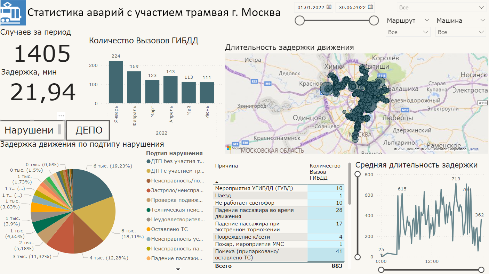

## Статистика аварий с участием трамвая г. Москва

По моему представлению главное в анализе ДТП трамвайного хозяйства это понять где наиболее «узкие зоны», на которые следует обратить внимание. 
Так как ДТП трамвая полностью парализует движение на нескольких маршрутах, требуется вывести в основные метрики время отработки ДТП, количество вызовов по времени, по расположению на карте, и адресовать каждому ДЕПО. Также выведено время наиболее опасное по статистике по случаям ДТП.

Наиболее показательной оказалось представление на карте по работе каждого Депо с визуализацией зон с большего времени задержки маршрута

Статистика причин ДТП - метрика второго уровня, которая показывает что именно нужно улучшать каждому ДЕПО (работу в коллективе или карту следования).

Интерактивные элементы: фильтры справа вверху, кнопки "Нарушения», «ДЕПО".

