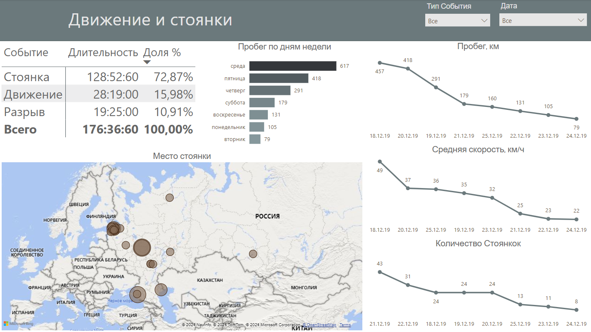
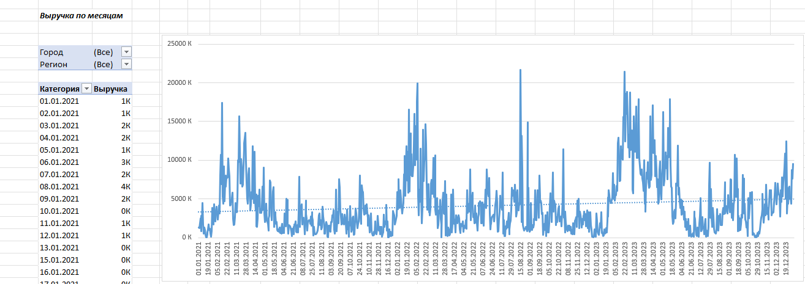
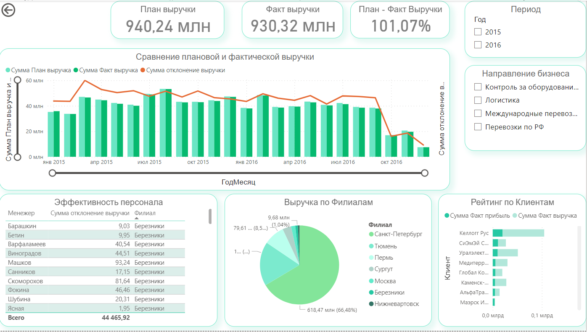
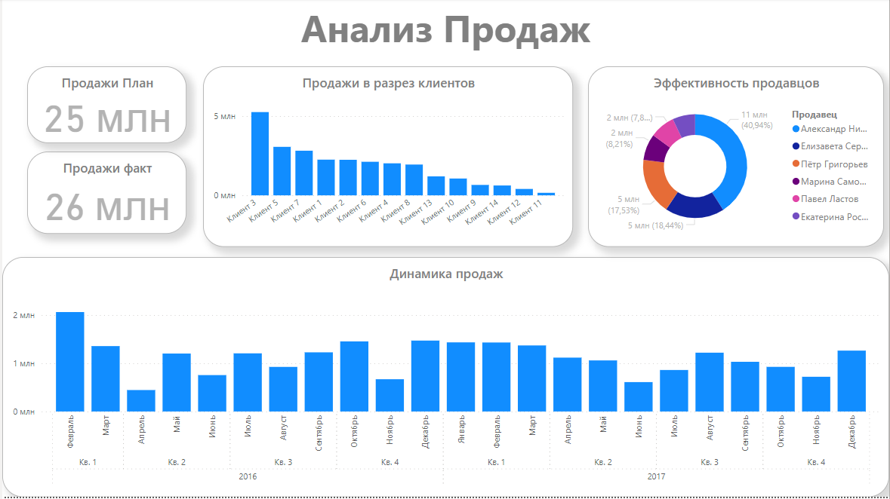
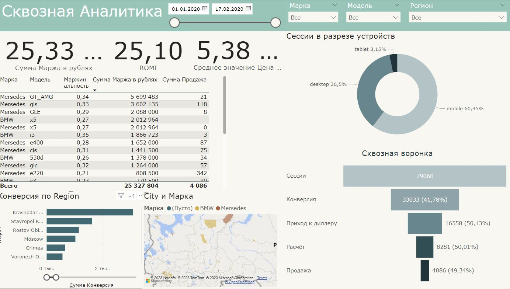

# Power BI practic projects

## 11 Автодиллер 

## 10 Движения и стоянки
*Подготовка данных из неструктурированной таблицы Данные Мониторинга.xlsx*

## 08 Tram Accident

## 06 Exel Dashboard 
*Визуальное представление данных из сводных таблиц*

## 05 Аско

## 04 Анализ продаж 
*По клиентам, в разрезе периода с перекрёстной фильтрацией между элементами отчётами*

## 03 Тестовое заданеи Сфера

## 01 Автодиллер продажи по регионам

